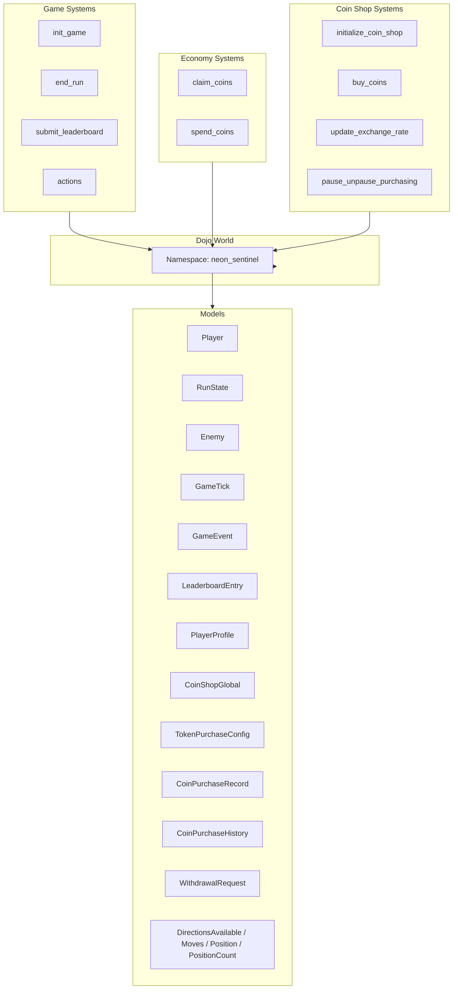

# Neon Sentinel


**Neon Sentinel** is a Dojo Autonomous World — a provable, on-chain game and world logic running on Starknet. The world is the source of truth: runs are deterministic, replay-verifiable, and leaderboard entries are immutable once submitted.

[](https://discord.com/invite/dojoengine)
[![Telegram Chat][tg-badge]][tg-url]

[tg-badge]: https://img.shields.io/endpoint?color=neon&logo=telegram&label=chat&style=flat-square&url=https%3A%2F%2Ftg.sumanjay.workers.dev%2Fdojoengine
[tg-url]: https://t.me/dojoengine

---

## What Is Neon Sentinel?

- **Autonomous World** — Game state, runs, and leaderboards live on-chain in a Dojo world. No off-chain game server; the chain is the authority.
- **Run-based gameplay (BALANCED)** — Players start a run (`init_game`), simulate gameplay client-side (ticks, hits, score), then end the run by submitting final state (`end_run(run_id, final_score, total_kills, final_layer)`) and optionally submit to the weekly leaderboard (`submit_leaderboard`).
- **Coins and upgrades** — Players earn coins via daily claims (`claim_coins`) or by purchasing with STRK (`buy_coins`), and spend them on pregame upgrades when starting a run (`init_game` with upgrades). Coins are deducted and recorded in an append-only history.
- **Security by design** — Block-based timing (no client time), immutable run state after `end_run`; leaderboard and coins remain chain-verified. (BALANCED: client-submitted score/kills/layer trusted; optional replay verification later.)

---

## Contracts Architecture

The Dojo **World** owns the canonical state. All systems are Starknet contracts registered as writers of the `neon_sentinel` namespace. Support modules (`erc20`, `owner_access`, `token_validation`) provide shared logic and are not deployed as standalone contracts.



---

## Project Structure

```
neon-sentinel-dojo/
├── src/
│   ├── lib.cairo              # Package root (systems, models, tests)
│   ├── models.cairo           # Dojo models (Player, RunState, Enemy, GameTick, LeaderboardEntry, CoinShop*, etc.)
│   ├── erc20.cairo            # ERC20 interface (for STRK token)
│   ├── owner_access.cairo     # Owner checks (coin shop)
│   ├── token_validation.cairo # STRK amount/allowance/balance validation
│   ├── systems/               # World systems (contracts)
│   │   ├── actions.cairo      # Starter (move/spawn)
│   │   ├── init_game.cairo
│   │   ├── end_run.cairo       # BALANCED: client-submitted final state
│   │   ├── submit_leaderboard.cairo
│   │   ├── claim_coins.cairo
│   │   ├── spend_coins.cairo
│   │   ├── buy_coins.cairo        # STRK → in-game coins
│   │   ├── initialize_coin_shop.cairo
│   │   ├── update_exchange_rate.cairo
│   │   └── pause_unpause_purchasing.cairo
│   └── tests/
│       ├── test_coin_shop.cairo
│       ├── test_systems_integration.cairo
│       └── test_world.cairo
├── dojo_dev.toml              # Dojo world config (dev)
├── Scarb.toml                 # Cairo/Scarb config
└── docs/
    ├── DEVELOPERS_BIBLE.md    # Deep dive into code and architecture
    ├── INTEGRATION_BIBLE.md   # Frontend integration guide
    ├── MANUAL_TESTING_STRK.md   # STRK coin purchase manual test checklist
    ├── SECURITY_REVIEW_STRK.md   # Security review checklist (coin shop)
    └── DEPLOY_TESTNET.md        # Deploy world to Sepolia testnet
```

---

## Running Locally

### Prerequisites

- [Dojo / Sozo](https://book.dojoengine.org/getting-started/installation)
- [Katana](https://book.dojoengine.org/toolchain/katana/overview) (local Starknet)
- [Torii](https://book.dojoengine.org/toolchain/torii/overview) (indexer / GraphQL, for frontends)

### Terminal 1 — Katana

```bash
katana --dev --dev.no-fee
```

### Terminal 2 — Build, migrate, Torii

```bash
# Build
sozo build

# Inspect world
sozo inspect

# Migrate (deploy world and systems)
sozo migrate

# Start Torii (replace <WORLD_ADDRESS> with the address from sozo migrate)
torii --world <WORLD_ADDRESS> --http.cors_origins "*"
```

### Docker

You can run the stack with Docker Compose:

```bash
docker compose up
```

---

## Documentation

| Document                                                | Description                                                             |
| ------------------------------------------------------- | ----------------------------------------------------------------------- |
| [DEVELOPERS_BIBLE.md](docs/DEVELOPERS_BIBLE.md)         | Architecture, models, systems, constants, security, and testing.        |
| [INTEGRATION_BIBLE.md](docs/INTEGRATION_BIBLE.md)       | Frontend integration: world calls, entities, events, and Torii/GraphQL. |
| [MANUAL_TESTING_STRK.md](docs/MANUAL_TESTING_STRK.md)   | Manual testing checklist for STRK → in-game coins flow.                 |
| [SECURITY_REVIEW_STRK.md](docs/SECURITY_REVIEW_STRK.md) | Security review checklist for the coin shop (STRK purchase) system.     |
| [DEPLOY_TESTNET.md](docs/DEPLOY_TESTNET.md)           | Step-by-step guide to deploy the world to Starknet Sepolia testnet.    |

---

## Quick Flow Summary

1. **Profile / coins** — Ensure the player has a `PlayerProfile` (e.g. seeded). They can `claim_coins` once per 24h (≈7200 blocks) or `buy_coins(amount_strk, max_coins_expected)` to purchase coins with STRK (after the shop is initialized and STRK approved).
2. **Start run** — `init_game(kernel, pregame_upgrades_mask, expected_cost)`. Creates `Player` and `RunState`, deducts coins if `expected_cost > 0`.
3. **Play (client-side)** — Simulate ticks, movement, hits, and score locally. No on-chain tick or hit systems in BALANCED.
4. **End run** — `end_run(run_id, final_score, total_kills, final_layer)`. Submits client-computed final state; sets `is_finished`, updates Profile and (if score ≥ 1000) awards bonus coins; marks player inactive.
5. **Leaderboard** — `submit_leaderboard(run_id, week)`. Week = `block_number / 50400`. Creates immutable `LeaderboardEntry` with proof fields.

---

## Contribution

- **Bugs** — [Open an issue](https://github.com/otaiki1/neon-sentinel-contract/issues).
- **Features** — [Request a feature](https://github.com/otaiki1/neon-sentinel-contract/issues).
- **Code** — Pull requests are welcome.

Happy coding!
