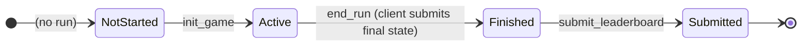

# Neon Sentinel — Developer's Bible

**Full technical and architectural overview** of the Neon Sentinel Dojo Autonomous World: storage model, state machines, systems, security, determinism, and testing.

---

## Part I — Technical Architecture

### 1.1 Dojo World Model

Neon Sentinel is a **Dojo Autonomous World**: a single World contract owns the canonical game state. All gameplay and economy are expressed as **systems** (Starknet contracts) that read and write **models** (key–value entities) in a **namespace**.

```mermaid
flowchart LR
  subgraph world [World Contract]
    NS[Namespace neon_sentinel]
  end
  subgraph models [Models]
    P[Player]
    R[RunState]
    E[Enemy]
    GT[GameTick]
    GE[GameEvent]
    LB[LeaderboardEntry]
    PP[PlayerProfile]
  end
  subgraph systems [Systems]
    IG[init_game]
    ER[end_run]
    SL[submit_leaderboard]
    CC[claim_coins]
    SC[spend_coins]
    BC[buy_coins]
    ICS[initialize_coin_shop]
    UER[update_exchange_rate]
    PUP[pause_unpause_purchasing]
    PC[purchase_cosmetic]
    ACT[actions]
  end
  systems -->|read/write| NS
  NS --> models
```



- **Namespace:** `neon_sentinel`. All game models and permitted writers are scoped to this namespace.
- **Writers (BALANCED):** Only the following system contracts may write to `neon_sentinel`: `actions`, `init_game`, `end_run`, `submit_leaderboard`, `claim_coins`, `spend_coins`, `purchase_cosmetic`, `buy_coins`, `initialize_coin_shop`, `update_exchange_rate`, `pause_unpause_purchasing`. Gameplay (ticks, hits) is client-side; chain accepts final state via `end_run`. Calling init_game again abandons the previous run (new run_id); end_run validates run_id and consolidates. Rank NFTs are minted in end_run when the player reaches a new rank tier. Enforced by Dojo at the world level.
- **Storage:** Models are stored under their composite key (e.g. `(player_address)` for Player, `(player_address, run_id)` for RunState). No system can write a model it does not have permission for; clients cannot write directly.

### 1.2 Execution and Timing

- **Authority:** The chain is the single source of truth. Every state transition is a transaction; block order defines event order.
- **Timing:** Systems use `get_execution_info().block_info.block_number` and `block_timestamp`. Leaderboard **week** is derived from **block_timestamp** (7 real days per period); block_number is used for claim cooldowns, submission_block, etc. Client-provided timestamps are never used for game rules.
- **Determinism:** Run identity and tick order are deterministic from chain data. Replay verification relies on the same: given the same `run_id`, block sequence, and inputs, the same state transitions are reproducible.

### 1.3 High-Level Data Flow

```mermaid
sequenceDiagram
  participant Client
  participant World
  participant InitGame
  participant EndRun
  participant SubmitLB

  Client->>InitGame: init_game(kernel, mask, cost)
  InitGame->>World: write Player, RunState, GameEvent; update Profile
  InitGame-->>Client: run_id implicit in state

  Note over Client: Client simulates gameplay locally (ticks, hits, score)

  Client->>EndRun: end_run(run_id, final_score, total_kills, final_layer)
  EndRun->>World: set is_finished, final_*; update Profile; Player inactive; GameEvent

  Client->>SubmitLB: submit_leaderboard(run_id, week)
  SubmitLB->>World: write LeaderboardEntry; set submitted_to_leaderboard
```

---

## Part II — Run and Player Lifecycle

### 2.1 Run State Machine

A run progresses through well-defined phases. No transition is reversible.



- **NotStarted:** No row for this player in Player, or `Player.is_active == false` and no current run in progress.
- **Active:** `Player.is_active == true`, `RunState.is_finished == false`. Gameplay is simulated client-side; no on-chain tick or hit systems.
- **Finished:** `end_run(run_id, final_score, total_kills, final_layer)` has been called. Chain accepts client-submitted final state. `RunState.is_finished == true`, `final_score`, `enemies_defeated`, `final_layer` set; Player inactive. RunState is **immutable** from this point (no system writes to score/layer/kills).
- **Submitted:** `submit_leaderboard` has been called. `RunState.submitted_to_leaderboard == true`; a `LeaderboardEntry` exists. One-time only per run.

### 2.2 Player Row Semantics

- **Single active run:** At most one run per player at a time. `Player` is keyed by `player_address`; the row holds the **current** run’s live state (position, lives, meters, tick_counter) when `is_active == true`.
- **After end_run:** `is_active` is set to false. The same Player row may be overwritten by a future `init_game`; the previous run’s history lives only in RunState (and GameTick, GameEvent, LeaderboardEntry) keyed by `run_id`.

### 2.3 Run Identity (BALANCED)

- **run_id:** Computed in `init_game` from `block_number`, `block_timestamp`, and caller. Formula:
    - `low = block_number + block_timestamp * 2^64`
    - `high = 0`
    - So run_id is a u256 that uniquely identifies the run and is **not** chosen by the client. Same block and caller ⇒ same run_id.
- **BALANCED:** No on-chain tick or hit processing. Client simulates the run and submits final score, total kills, and final layer via `end_run`. Chain trusts client-submitted values (leaderboard and coins remain chain-verified).

---

## Part III — Models (Full Specification)

Every model is a `#[dojo::model]` struct. Keys are marked with `#[key]` and uniquely identify the entity.

### 3.1 Player

| Field                                             | Type            | Semantics                                                                             |
| ------------------------------------------------- | --------------- | ------------------------------------------------------------------------------------- |
| **player_address**                                | ContractAddress | Key. Caller identity.                                                                 |
| run_id                                            | u256            | Current run; set at init, unchanged until next init.                                  |
| is_active                                         | bool            | True iff this player has an active run.                                               |
| x, y                                              | u32             | Position (client-side in BALANCED; init_game sets start).                             |
| lives, max_lives                                  | u8              | Lives and cap (client-side in BALANCED).                                              |
| kernel                                            | u8              | Kernel index 0..5; set at init, never changed mid-run.                                |
| invincible_until_block                            | u64             | Block until which player is invincible (set at init = block_number).                  |
| overclock_meter, shock_bomb_meter, god_mode_meter | u32             | Ability meters; charged by gameplay, spent by actions.                                |
| overclock_active, god_mode_active                 | bool            | Active ability flags (client-side in BALANCED).                                        |
| upgrades_verified                                 | bool            | Set true at init; locks upgrades for the run.                                         |
| tick_counter                                      | u32             | Number of ticks this player has processed; must match RunState.total_ticks_processed. |
| last_tick_block                                   | u64             | Set by end_run when run ends (block when finalized).                                  |

**Writers (BALANCED):** init_game (create/overwrite), end_run (set is_active false).  
**Invariants:** `lives <= max_lives`; position within world bounds (client-side in BALANCED).

### 3.2 RunState

| Field                                              | Type                  | Semantics                                                                      |
| -------------------------------------------------- | --------------------- | ------------------------------------------------------------------------------ |
| **player_address**, **run_id**                     | ContractAddress, u256 | Composite key.                                                                 |
| current_layer, current_prestige                    | u8                    | Layer 1..MAX_LAYER; prestige for future use.                                   |
| score                                              | u64                   | Not updated on-chain in BALANCED; final_score set by end_run from client.     |
| combo_multiplier                                   | u32                   | 1000 = 1.0x (client-side in BALANCED).                                        |
| corruption_level, corruption_multiplier            | u32                   | Corruption (client-side in BALANCED).                                         |
| started_at_block, last_tick_block                  | u64                   | Block bounds; last_tick_block set by end_run.                                 |
| total_ticks_processed                              | u32                   | Not updated on-chain in BALANCED (client simulates).                          |
| enemies_defeated, shots_fired, shots_hit, accuracy | u32                   | enemies_defeated set by end_run from client total_kills; others client-side. |
| is_finished                                        | bool                  | Set true by end_run; thereafter run state is read-only.                       |
| final_score, final_layer                           | u64, u8               | Set by end_run from client-submitted values; immutable after.                 |
| submitted_to_leaderboard                           | bool                  | Set true by submit_leaderboard; at most once per run.                         |
| pregame_upgrades_mask                              | u256                  | Attestation of which pregame upgrades were used this run (set at init_game).  |
| revive_count                                       | u32                   | Number of revives used this run; cost = 100×2^revive_count. Updated by spend_revive. |

**Writers (BALANCED):** init_game (create), end_run (set finished + final_score, enemies_defeated, final_layer), submit_leaderboard (set submitted_to_leaderboard only), spend_revive (revive_count only).  
**Invariants:** After `is_finished == true`, no system modifies score, layer, or enemies_defeated; only `submitted_to_leaderboard` may be set to true.

### 3.3 Enemy

| Field                                                       | Type                  | Semantics                                                                           |
| ----------------------------------------------------------- | --------------------- | ----------------------------------------------------------------------------------- |
| **enemy_id**                                                | u256                  | Key. Unique per enemy instance.                                                     |
| run_id, player_address                                      | u256, ContractAddress | Owner run and player.                                                               |
| enemy_type                                                  | u8                    | Type identifier (e.g. 1..10).                                                       |
| health, max_health                                          | u32                   | Enemy state (reference only in BALANCED; no on-chain hit updates).                 |
| x, y                                                        | u32                   | Position (client-side in BALANCED).                                                 |
| is_active                                                   | bool                  | Reference only in BALANCED.                                                         |
| spawn_block, last_position_update_block, destroyed_at_block | u64                   | Block timestamps.                                                                   |
| destruction_verified                                        | bool                  | Reference only in BALANCED.                                                         |

**Writers (BALANCED):** External spawn / tests only; no on-chain tick or hit systems.  
**Invariants:** Enemy model kept for reference; gameplay (hits, position) is client-side.

### 3.4 GameTick

| Field                                           | Type                       | Semantics                                 |
| ----------------------------------------------- | -------------------------- | ----------------------------------------- |
| **player_address**, **run_id**, **tick_number** | ContractAddress, u256, u32 | Composite key.                            |
| block_number, timestamp                         | u64                        | Block at which tick was processed.        |
| player_input                                    | u8                         | Low 3 bits direction, high bits action.   |
| input_sig                                       | u256                       | Placeholder for future input attestation. |
| player_x, player_y                              | u32                        | Position after this tick.                 |
| score_delta, enemies_killed, damage_taken       | u64, u32, u32              | Deltas this tick.                         |
| combo_before, combo_after                       | u32                        | Combo around this tick.                   |
| state_hash_before, state_hash_after, tick_hash  | u256                       | For replay and verification.              |

**Writers (BALANCED):** Not written by core systems (client simulates).  
**Invariants:** tick_number is sequential. In BALANCED, total_ticks_processed stays 0, so submit_leaderboard does not read GameTick (replay_verifiable remains false).

### 3.5 GameEvent

| Field                                         | Type                  | Semantics                                                  |
| --------------------------------------------- | --------------------- | ---------------------------------------------------------- |
| **event_id**                                  | u256                  | Key. Deterministic from run_id, entity, block, event_type. |
| run_id, player_address                        | u256, ContractAddress | Context.                                                   |
| event_type                                    | u8                    | 1=hit, 2=powerup, 3=layer, 6=game_start, 7=game_end.       |
| tick_number, block_number                     | u32, u64              | When.                                                      |
| entity_id, data_primary, data_secondary       | u256                  | Payload (e.g. enemy_id, damage, combo).                    |
| game_state_hash_before, game_state_hash_after | u256                  | Optional verification.                                     |
| verified                                      | bool                  | Reserved.                                                  |

**Writers (BALANCED):** init_game (game_start), end_run (game_end). Append-only.

### 3.6 LeaderboardEntry

| Field                                                  | Type                     | Semantics                                           |
| ------------------------------------------------------ | ------------------------ | --------------------------------------------------- |
| **entry_id**                                           | u256                     | Key. Deterministic: run_id.low + week, run_id.high. |
| player_address, player_name                            | ContractAddress, felt252 | Player; name placeholder.                           |
| week                                                   | u32                      | Timestamp-based period index: block_timestamp / SECONDS_PER_WEEK (604800). One board per week. |
| final_score, deepest_layer, prestige_level             | u64, u8, u8              | From RunState at submit.                            |
| survival_blocks                                        | u64                      | last_tick_block - started_at_block.                 |
| max_corruption, enemies_defeated, peak_combo, accuracy | u32                      | Run stats.                                          |
| run_id                                                 | u256                     | Submitted run.                                      |
| submission_block                                       | u64                      | Block at which submitted.                           |
| submission_hash                                        | u256                     | state_hash_for_run(RunState) at submit.             |
| event_log_hash                                         | u256                     | Placeholder for event chain hash.                   |
| game_seed                                              | u256                     | Same as run_id (run_id is the seed).                |
| replay_verifiable                                      | bool                     | True if at least one GameTick exists.               |
| tick_count, aberrations_detected                       | u32                      | Tick count; aberrations reserved.                   |
| verified                                               | bool                     | Set true on submit.                                 |

**Writers:** submit_leaderboard only. Entry is immutable after creation.

### 3.7 PlayerProfile

| Field                                                             | Type            | Semantics                                                              |
| ----------------------------------------------------------------- | --------------- | ---------------------------------------------------------------------- |
| **player_address**                                                | ContractAddress | Key.                                                                   |
| current_prestige, current_layer, highest_prestige_reached         | u8              | Progress.                                                              |
| highest_rank_id                                                    | u8              | Highest of the 18 ranks achieved (0 = none, 1..18). Source of truth for displayed rank. |
| highest_rank_tier_minted                                           | u8              | Kept in sync with highest_rank_id (1..18) for legacy/tier readers.     |
| is_prime_sentinel                                                 | bool            | Flag.                                                                  |
| total_runs, lifetime_score, lifetime_playtime_blocks, ...         | u32/u64         | Aggregates.                                                            |
| coins                                                             | u32             | Balance; increased by claim_coins, buy_coins, end_run (prestige/score bonus); decreased by init_game, spend_coins, spend_revive, purchase_cosmetic, purchase_mini_me_*. |
| last_coin_claim_block                                             | u64             | Last claim block; claim_coins requires block - this >= 7200.           |
| last_prime_sentinel_claim_block                                   | u64             | Last Prime Sentinel bonus claim; 3 extra coins once per 7200 blocks when is_prime_sentinel. |
| mini_me_sessions_purchased                                       | u32             | Session packs bought; capacity = 3 + this × 3.                        |
| coin_transaction_log_hash                                         | u256            | Append-only hash chain of coin ops.                                    |
| coin_transaction_count                                            | u32             | Number of coin transactions.                                           |
| selected_kernel, kernel_unlocks, avatar_unlocks, cosmetic_unlocks | u8/u64          | Unlocks.                                                               |
| last_profile_update_block, profile_hash                           | u64, u256       | Metadata.                                                              |

**Writers:** init_game (coins, log hash, count), claim_coins (coins, last_coin_claim_block, last_prime_sentinel_claim_block, log hash, count), spend_coins (coins, log hash, count), buy_coins (coins, log hash, count), spend_revive (coins, log hash, count), purchase_cosmetic (coins, kernel_unlocks, log hash, count), purchase_mini_me_unit (coins, log hash, count), purchase_mini_me_sessions (coins, mini_me_sessions_purchased, log hash, count), end_run (highest_rank_id, highest_rank_tier_minted when a new rank milestone is reached). Profile is created/updated by systems or by world setup; clients cannot write.

### 3.8 Rank catalog and RankNFT

**Rank catalog** (`src/rank_config.cairo`): 18 named ranks at fixed (prestige, layer) milestones. Tier display: 1 = entry, 2 = intermediate, 3 = advanced, 4 = elite, 5 = legendary. Functions: `rank_id_for_milestone(prestige, layer)` → 1..18 or 0; `tier_for_rank(rank_id)` → 1..5.

**RankNFT model:**

| Field              | Type              | Semantics                                                                 |
| ------------------ | ----------------- | ------------------------------------------------------------------------- |
| **owner**          | ContractAddress   | Key.                                                                      |
| **rank_id**        | u8                | Key. 1..18; one NFT per (owner, rank_id).                                 |
| rank_tier          | u8                | 1..5 (entry..legendary).                                                 |
| prestige, layer    | u8                | Prestige and layer at which this rank was achieved.                       |
| achieved_at_block  | u64               | Block when minted.                                                        |
| run_id             | u256              | Run that achieved the milestone.                                          |
| token_id           | u256              | Optional; deterministic from owner + rank_id for external indexing.      |

**Writers:** end_run only. Minted when the player finishes a run at a milestone (prestige, final_layer) that maps to a rank_id and that rank was not already minted for that owner.

### 3.9 MiniMeInventory

- **Keys:** player_address, unit_type (u8, 0..6). **Fields:** count (u8, max 20 per type). Writer: purchase_mini_me_unit.

### 3.10 Coin Shop Models

- **CoinShopGlobal** — Singleton (key = 0): global_key, owner only. Used to resolve the owner so systems can read TokenPurchaseConfig by owner. Writers: initialize_coin_shop (create).
- **TokenPurchaseConfig** — Key: owner (ContractAddress). Holds strk_token_address, coin_exchange_rate, total_strk_collected, total_strk_withdrawn, total_coins_sold, paused, last_updated, next_withdrawal_id, etc. Writers: initialize_coin_shop (one-time), update_exchange_rate (rate only), pause_unpause_purchasing (paused), buy_coins (totals, withdrawals).
- **CoinPurchaseRecord** — Per-purchase record (purchase_id, player, strk_amount, coins_minted, block, etc.). Writer: buy_coins.
- **CoinPurchaseHistory** — Per-player aggregate (player_address, purchase_count, last_purchase_block, etc.). Writer: buy_coins.
- **WithdrawalRequest** — Per-withdrawal (withdrawal_id, amount, status: pending/executed, blocks). Writers: buy_coins (request_withdrawal, execute_withdrawal, withdraw_strk).

---

## Part IV — Systems (Deep Dive)

### 4.1 init_game

- **Purpose:** Start a new run: create Player and RunState, optionally spend coins on pregame upgrades, emit game_start.
- **run_id:** `compute_run_seed(block_number, block_timestamp, caller)` → u256 with low = block_number + block_timestamp \* 2^64, high = 0.
- **Kernel:** Valid 0..10. Must own kernel (kernel_unlocks bit set; kernel 0 always allowed). Requires profile.current_prestige >= prestige_required(kernel). Kernel 10 also requires profile.is_prime_sentinel.
- **Upgrade cost:** `compute_upgrade_cost(mask)` = sum of pregame prices for set bits 0..6 (see coin_shop_config: 25, 50, 40, 45, 40, 35, 30). Client must pass this as `expected_cost`; contract asserts equality.
- **Coin accounting:** If expected_cost > 0, profile.coins decreased, coin_transaction_log_hash and coin_transaction_count updated, CoinSpent emitted (reason: pregame_upgrades).
- **Initial state:** Player at (0,0), lives 3, max_lives 20, layer 1, invincible_until_block = block_number; RunState score 0, is_finished false, submitted_to_leaderboard false, revive_count 0.

### 4.2 end_run (BALANCED)

- **Purpose:** Finalize the run with **client-submitted** final state. Client simulates gameplay locally (ticks, hits, score); chain accepts final_score, total_kills, final_layer.
- **Signature:** `end_run(run_id, final_score, total_kills, final_layer)`. Parameters: run_id (u256), final_score (u64), total_kills (u32), final_layer (u8).
- **Logic:** Assert run active and not already finished; set RunState.is_finished = true, final_score, enemies_defeated = total_kills, final_layer, last_tick_block; set Player.is_active = false; update PlayerProfile (total_runs += 1, lifetime_enemies_defeated += total_kills, lifetime_score += final_score, best_run_score if improved, current_layer if final_layer higher); award bonus coins if final_score >= LEADERBOARD_MIN_SCORE (1000); if final_layer == 6 (cleared), award prestige coins 2×2^current_prestige and advance current_prestige/highest_prestige_reached, and if current_prestige was 8 set is_prime_sentinel = true. **Rank:** Compute rank_id = rank_id_for_milestone(run_state.current_prestige, final_layer). If rank_id > 0 and rank_id > profile.highest_rank_id, set profile.highest_rank_id and profile.highest_rank_tier_minted = rank_id. If rank_id > 0 and RankNFT at (caller, rank_id) not already minted (e.g. achieved_at_block == 0), write RankNFT(owner=caller, rank_id, rank_tier=tier_for_rank(rank_id), prestige, layer, achieved_at_block, run_id, token_id). Emit game_end GameEvent; write RunState, Player, PlayerProfile.
- **Constants:** LEADERBOARD_MIN_SCORE = 1000, SCORE_BONUS_COINS = 10.
- **Trust:** Chain trusts client-submitted score/kills/layer. Leaderboard and coins remain chain-verified; optional replay/bounds checks can be added later.

### 4.3 submit_leaderboard

- **Purpose:** Record the finished run on the weekly leaderboard with proof fields; one submission per run.
- **Week:** `current_leaderboard_week(block_timestamp) = block_timestamp / SECONDS_PER_WEEK` (604800 = 7 days). One leaderboard week = 7 real days regardless of block production. Client must pass this value; contract asserts week == current_leaderboard_week(block_timestamp).
- **Replay check:** If total_ticks_processed > 0, reads GameTick for (caller, run_id, total_ticks_processed) to ensure the tick chain exists; sets replay_verifiable = true. **BALANCED:** total_ticks_processed is not updated on-chain (remains 0 from init_game), so replay_verifiable is false and GameTick is never read.
- **entry_id:** `entry_id_for_run_week(run_id, week)` = u256 { low: run_id.low + week, high: run_id.high }.
- **submission_hash:** Same as state_hash_for_run(run_state). game_seed = run_id. event_log_hash is placeholder (zero) until incremental event hashing is added.

### 4.4 claim_coins

- **Purpose:** Grant 3 coins once per 24h (7200 blocks). First claim allowed when last_coin_claim_block == 0; otherwise block_number - last_coin_claim_block >= 7200. If profile.is_prime_sentinel and (last_prime_sentinel_claim_block == 0 or block - last_prime_sentinel_claim_block >= 7200), grant 3 extra coins and set last_prime_sentinel_claim_block = block_number.
- **Accounting:** Same next_coin_log_hash and coin_transaction_count increment; emits CoinClaimed.

### 4.5 spend_coins

- **Purpose:** Deduct coins for any reason (amount > 0, balance sufficient). Updates log hash and count, emits CoinSpent, returns true. init_game implements its own deduction and the same log/count/event pattern for pregame upgrades.

### 4.6 initialize_coin_shop

- **Purpose:** One-time setup of the STRK → coins shop. Caller becomes owner. Sets CoinShopGlobal (owner, paused false), TokenPurchaseConfig (strk_token_address, exchange_rate). Exchange rate must be in [3, 100]. Re-initialization blocked by existing config check.
- **Writers:** Creates/updates CoinShopGlobal, TokenPurchaseConfig. Emits CoinShopInitialized.

### 4.7 buy_coins

- **Purpose:** User purchases in-game coins with STRK. User must approve STRK to the buy_coins contract; then calls buy_coins(amount_strk). Coins = amount_strk * exchange_rate (u32); no slippage parameter. STRK is transferFrom(caller → contract); profile coins and log hash/count updated. Max 1000 STRK per tx. Writes CoinPurchaseRecord, CoinPurchaseHistory. Owner can withdraw_strk, request_withdrawal + execute_withdrawal (with delay), and pause/unpause via pause_unpause_purchasing.
- **Writers:** CoinShopGlobal (totals, paused), PlayerProfile (coins, log, count), CoinPurchaseRecord, CoinPurchaseHistory, WithdrawalRequest. Emits CoinsPurchased, StrkWithdrawn, WithdrawalRequestCreated, WithdrawalExecuted, etc.

### 4.8 update_exchange_rate

- **Purpose:** Owner-only. Updates TokenPurchaseConfig.coin_exchange_rate. New rate must be within [3, 100] and within ±20% of previous rate. Emits ExchangeRateUpdated.

### 4.9 pause_unpause_purchasing

- **Purpose:** Owner-only. Toggles TokenPurchaseConfig.paused. When paused, buy_coins reverts. Emits PurchasingPauseToggled.

### 4.10 purchase_cosmetic (kernels 0..10, price + prestige)

- **Purpose:** Spend coins to unlock kernel (0..10), avatar, or skin. Kernels: per-kernel price and prestige_required from coin_shop_config; kernel 10 also requires is_prime_sentinel. Kernel 0 is free and always unlocked. Deducts coins, sets bit in kernel_unlocks/avatar_unlocks/cosmetic_unlocks, sets selected_kernel for kernel. Avatar/skin: 1 coin per item.

### 4.11 spend_revive

- **Purpose:** During an active run, spend coins to revive. Cost = 100 × 2^RunState.revive_count (1st 100, 2nd 200, …). Asserts run active, run_id match, run not finished, sufficient coins; increments RunState.revive_count and deducts coins. Emits RevivePurchased.

### 4.12 purchase_mini_me_unit

- **Purpose:** Add one Mini-Me unit to inventory (unit_type 0..6). Prices 50, 75, 100, 100, 75, 125, 125. Max 20 per type. Reads/creates MiniMeInventory(player, unit_type), increments count, deducts coins.

### 4.13 purchase_mini_me_sessions

- **Purpose:** Spend 100 coins to add +3 sessions permanently (profile.mini_me_sessions_purchased += 1). Emits MiniMeSessionsPurchased.

### 4.14 actions

- **Purpose:** Starter spawn/move for Position and Moves (demo flow). spawn: sets Position (+10, +10) and Moves (remaining 100). move: decrements remaining moves, updates position by direction, emits Moved.
- **Safety:** move() asserts `moves.remaining > 0` before decrement to avoid underflow. next_position() only decrements x (Left) or y (Up) when value > 0 to avoid underflow at origin.

---

## Part V — Constants and Formulas

### 5.1 Constants Table

| Constant                                         | Value     | Location                                  | Purpose                 |
| ------------------------------------------------ | --------- | ----------------------------------------- | ----------------------- |
| MAX_KERNEL                                       | 10        | init_game                                 | Valid kernel range 0..10 |
| Pregame prices (bit 0..6)                        | 25,50,40,45,40,35,30 | coin_shop_config                 | Coins per pregame upgrade |
| Kernel prices (0..10)                            | 0,500,500,1500,...7500 | coin_shop_config                 | Coins per kernel        |
| REVIVE_BASE_COINS                                | 100       | coin_shop_config                          | Revive cost base        |
| PRICE_MINI_ME_SESSIONS_PACK                      | 100       | coin_shop_config                          | Sessions pack price     |
| START_X, START_Y                                 | 0, 0      | init_game                                 | Initial position        |
| START_LIVES, MAX_LIVES                           | 3, 20     | init_game                                 | Lives                   |
| COMBO_ONE                                        | 1000      | init_game (client-side combo in BALANCED) | 1.0x combo basis        |
| BLOCKS_PER_DAY                                   | 7200      | claim_coins                               | 24h cooldown            |
| COINS_PER_CLAIM                                  | 3         | claim_coins                               | Coins per claim         |
| SECONDS_PER_WEEK                                 | 604800   | submit_leaderboard                        | Week length in seconds (7 days) |
| LEADERBOARD_MIN_SCORE                            | 1000      | end_run                                   | Score threshold for bonus coins |
| SCORE_BONUS_COINS                                | 10        | end_run                                   | Bonus coins if score >= threshold |
| MAX_LAYER                                        | 6         | (client-side in BALANCED)                 | Layers 1..6             |
| EVENT_TYPE_GAME_START/GAME_END                   | 6, 7      | init_game, end_run                        | GameEvent types         |

### 5.2 Key Formulas

- **run_id (init_game):** `low = block_number + block_timestamp * 2^64`, `high = 0`.
- **Upgrade cost:** `cost = sum of pregame_price(bit_index)` for each set bit 0..6 in mask (prices 25, 50, 40, 45, 40, 35, 30).
- **Revive cost:** `cost = 100 * 2^RunState.revive_count`.
- **Prestige coins (end_run, final_layer == 6):** `reward = 2 * 2^current_prestige`; then current_prestige += 1.
- **Coin log hash (append):** `next_coin_log_hash(prev, block_number, amount)` → low = prev.low + block_number + amount, high = prev.high + 1.
- **state_hash_for_run (submit_leaderboard):** low = final_score + final_layer * 2^32, high = total_ticks_processed + corruption_level * 2^32 (RunState set by end_run from client).
- **entry_id:** low = run_id.low + week, high = run_id.high.
- **Kernel damage mod:** 1000 + kernel \* 50 (kernel 0..5).
- **Layer threshold (layer 1..5):** 1000, 5000, 15000, 40000, 100000 for advancing to layer 2..6.

---

## Part VI — Security and Threat Model

### 6.1 Trust Assumptions

- **Chain:** Block order and block number are trusted. No client-controlled time is used for game rules.
- **Writers:** Only the registered system contracts can write to the namespace. Clients cannot create or modify Player, RunState, Enemy, LeaderboardEntry, or Profile directly.
- **Caller:** Systems use `get_caller_address()` for player identity; no delegation of “act as another player” in the core design.

### 6.2 Threat Mitigations

| Threat                                     | Mitigation                                                                                                             |
| ------------------------------------------ | ---------------------------------------------------------------------------------------------------------------------- |
| Score inflation (client lies)               | BALANCED trusts client for final_score/total_kills/final_layer; leaderboard and coins remain chain-verified. Optional replay/bounds later. |
| Double leaderboard submission              | submit_leaderboard asserts !submitted_to_leaderboard; sets it true after write.                                        |
| Time travel (claim coins early)            | claim_coins requires block - last_coin_claim_block >= 7200 (or first claim).                                           |
| Upgrade tampering mid-run                  | upgrades_verified set at init; no system changes upgrades during run.                                                  |
| Modify run after finish                    | No system writes to RunState gameplay fields after is_finished; submit_leaderboard only sets submitted_to_leaderboard. |

### 6.3 Invariants (Summary)

- **Run lifecycle (BALANCED):** init_game → (client simulates) → end_run(run_id, final_score, total_kills, final_layer) → [submit_leaderboard]. No backward transitions.
- **Score and kills:** Set by end_run from client-submitted values; leaderboard and coins remain chain-verified.
- **Position:** Client-side in BALANCED; no on-chain tick or hit systems.
- **Coins:** Balance changes via claim_coins (add daily + Prime bonus), buy_coins (add), end_run (prestige coins, score bonus), init_game (subtract for pregame upgrades), spend_coins, spend_revive, purchase_cosmetic, purchase_mini_me_unit, purchase_mini_me_sessions; all coin moves update log hash and count.

---

## Part VII — Testing Strategy

### 7.1 Unit Tests (models.cairo)

- **Player:** Creation with valid data; kernel 0 and 5; upgrades_verified true/false; ability fields 0/false.
- **RunState:** Creation; all metrics zero; is_finished false.
- **Enemy:** Creation with enemy_type 1 and 10; health set; is_active true.
- **GameTick:** Input and state hashes stored.
- **LeaderboardEntry:** All proof fields present; no mutation after creation (value snapshot).

### 7.2 Integration Tests (test_systems_integration.cairo)

- **World setup:** spawn_test_world with namespace containing all game models, init_game CoinSpent event, claim_coins CoinClaimed event, and system contracts; contract_defs grant writers; setup_world_with_profile seeds PlayerProfile with coins.
- **Flows (BALANCED):** init_game → Player/RunState created and coins deducted; client simulates gameplay; end_run(run_id, final_score, total_kills, final_layer) → is_finished, final state, Profile updated, bonus coins; submit_leaderboard → LeaderboardEntry created and verified.
- **Block control:** starknet::testing::set_block_number used to advance blocks between calls (e.g. for claim_coins).

### 7.3 Security / Error Tests

- **Ignored under scarb test:** Tests that expect a revert (invalid kernel, insufficient coins, out of range, replay same tick, double submit, upgrade tampering, etc.) use #[should_panic(expected: (...))] and #[ignore] because scarb test does not treat contract-call panics as success. Run with snforge to verify.
- **Positive security tests:** Score after init (run_state.score == 0), infinite lives (lives <= max_lives), end_run with client-submitted state (final_score, total_kills, final_layer) are asserted without panic.

### 7.4 Commands

```bash
scarb build
scarb test
```

---

## Part VIII — Source Layout and Extensions

### 8.1 Directory and Modules

```
src/
├── lib.cairo              # systems, models, tests, support modules
├── models.cairo           # All Dojo models; Vec2, Direction; unit tests
├── erc20.cairo            # ERC20 interface (STRK token)
├── owner_access.cairo     # IsOwnerTrait (coin shop)
├── token_validation.cairo # STRK amount/allowance/balance/transfer validation
└── systems/
    ├── actions.cairo           # Starter spawn/move
    ├── init_game.cairo
    ├── end_run.cairo           # BALANCED: client-submitted final state
    ├── submit_leaderboard.cairo
    ├── claim_coins.cairo
    ├── spend_coins.cairo
    ├── buy_coins.cairo            # STRK → in-game coins; treasury; withdrawals
    ├── initialize_coin_shop.cairo  # One-time shop setup (owner)
    ├── update_exchange_rate.cairo # Owner: change rate (capped 3..100)
    ├── pause_unpause_purchasing.cairo  # Owner: pause/unpause buying
    ├── spend_revive.cairo         # In-run revive (100×2^revive_count)
    ├── purchase_mini_me_unit.cairo   # Mini-Me inventory (type 0..6)
    └── purchase_mini_me_sessions.cairo # +3 sessions pack (100 coins)
src/tests/
├── test_coin_shop.cairo
├── test_systems_integration.cairo
└── test_world.cairo
```

### 8.2 Adding a New Model

- Define the struct in `models.cairo` with `#[dojo::model]` and `#[key]` fields.
- If the world schema is regenerated (e.g. sozo build), the new model is part of the world. Add it to Torii indexing if the frontend needs to query it.
- For tests that write it, add `TestResource::Model(m_YourModel::TEST_CLASS_HASH)` to the test namespace.

### 8.3 Adding a New System

- Create a new contract under `systems/` with its interface and implementation; use `self.world(@"neon_sentinel")` for storage.
- Register the module in `lib.cairo`.
- Add the contract to the `neon_sentinel` writers in `dojo_dev.toml`, `dojo_release.toml`, and (for testnet) `dojo_sepolia.toml`.
- If it emits events, add `TestResource::Event(your_module::e_YourEvent::TEST_CLASS_HASH)` and the contract to the integration test namespace and contract_defs.

### 8.4 Dependencies and Versions

- **Scarb.toml:** dojo 1.8.0, starknet 2.13.1, dojo_cairo_test 1.8.0, cairo_test 2.13.1.
- **World:** Dojo 1.8; default namespace `neon_sentinel`; writers listed in dojo config.

---

This document is the single technical and architectural reference for Neon Sentinel. Update it when adding or changing models, systems, constants, or security guarantees.
