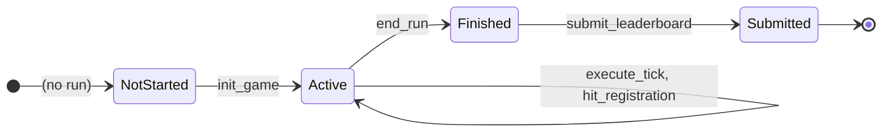

# Neon Sentinel — Developer's Bible

**Full technical and architectural overview** of the Neon Sentinel Dojo Autonomous World: storage model, state machines, systems, security, determinism, and testing.

---

## Part I — Technical Architecture

### 1.1 Dojo World Model

Neon Sentinel is a **Dojo Autonomous World**: a single World contract owns the canonical game state. All gameplay and economy are expressed as **systems** (Starknet contracts) that read and write **models** (key–value entities) in a **namespace**.

```mermaid
flowchart LR
  subgraph world [World Contract]
    NS[Namespace neon_sentinel]
  end
  subgraph models [Models]
    P[Player]
    R[RunState]
    E[Enemy]
    GT[GameTick]
    GE[GameEvent]
    LB[LeaderboardEntry]
    PP[PlayerProfile]
  end
  subgraph systems [Systems]
    IG[init_game]
    ET[execute_tick]
    HR[hit_registration]
    ER[end_run]
    SL[submit_leaderboard]
    CC[claim_coins]
    SC[spend_coins]
  end
  systems -->|read/write| NS
  NS --> models
```



- **Namespace:** `neon_sentinel`. All game models and permitted writers are scoped to this namespace.
- **Writers:** Only the following system contracts may write to `neon_sentinel`: `init_game`, `execute_tick`, `hit_registration`, `end_run`, `submit_leaderboard`, `claim_coins`, `spend_coins`, and the starter `actions`. Enforced by Dojo at the world level.
- **Storage:** Models are stored under their composite key (e.g. `(player_address)` for Player, `(player_address, run_id)` for RunState). No system can write a model it does not have permission for; clients cannot write directly.

### 1.2 Execution and Timing

- **Authority:** The chain is the single source of truth. Every state transition is a transaction; block order defines event order.
- **Timing:** All game-relevant time is **block-based**. Systems use `get_execution_info().block_info.block_number` (and, where needed, `block_timestamp`). Client-provided timestamps are never used for cooldowns, tick order, or leaderboard week.
- **Determinism:** Run identity and tick order are deterministic from chain data. Replay verification relies on the same: given the same `run_id`, block sequence, and inputs, the same state transitions are reproducible.

### 1.3 High-Level Data Flow

```mermaid
sequenceDiagram
  participant Client
  participant World
  participant InitGame
  participant ExecuteTick
  participant HitReg
  participant EndRun
  participant SubmitLB

  Client->>InitGame: init_game(kernel, mask, cost)
  InitGame->>World: write Player, RunState, GameEvent; update Profile
  InitGame-->>Client: run_id implicit in state

  loop Each tick
    Client->>ExecuteTick: execute_tick(run_id, input, sig, enemy_ids)
    ExecuteTick->>World: read Player, RunState, Enemies; write GameTick, updates
  end

  Client->>HitReg: hit_registration(run_id, enemy_id, damage, x, y, proof)
  HitReg->>World: update Enemy, RunState; write GameEvent(s)

  Client->>EndRun: end_run(run_id)
  EndRun->>World: set is_finished, final_*; write GameEvent; Player inactive

  Client->>SubmitLB: submit_leaderboard(run_id, week)
  SubmitLB->>World: write LeaderboardEntry; set submitted_to_leaderboard
```

---

## Part II — Run and Player Lifecycle

### 2.1 Run State Machine

A run progresses through well-defined phases. No transition is reversible.



- **NotStarted:** No row for this player in Player, or `Player.is_active == false` and no current run in progress.
- **Active:** `Player.is_active == true`, `RunState.is_finished == false`. Only `execute_tick` and `hit_registration` may mutate run state.
- **Finished:** `end_run` has been called. `RunState.is_finished == true`, `final_score` and `final_layer` are set; Player is inactive. RunState is **immutable** from this point (no system writes to score/layer/ticks).
- **Submitted:** `submit_leaderboard` has been called. `RunState.submitted_to_leaderboard == true`; a `LeaderboardEntry` exists. One-time only per run.

### 2.2 Player Row Semantics

- **Single active run:** At most one run per player at a time. `Player` is keyed by `player_address`; the row holds the **current** run’s live state (position, lives, meters, tick_counter) when `is_active == true`.
- **After end_run:** `is_active` is set to false. The same Player row may be overwritten by a future `init_game`; the previous run’s history lives only in RunState (and GameTick, GameEvent, LeaderboardEntry) keyed by `run_id`.

### 2.3 Run Identity and Determinism

- **run_id:** Computed in `init_game` from `block_number`, `block_timestamp`, and caller. Formula:
  - `low = block_number + block_timestamp * 2^64`
  - `high = 0`
  - So run_id is a u256 that uniquely identifies the run and is **not** chosen by the client. Same block and caller ⇒ same run_id.
- **Tick order:** `execute_tick` requires `tick_counter == total_ticks_processed` and `block_number > last_tick_block`. Thus ticks are strictly sequential and bound to increasing blocks; replay of the same tick at the same block is rejected.

---

## Part III — Models (Full Specification)

Every model is a `#[dojo::model]` struct. Keys are marked with `#[key]` and uniquely identify the entity.

### 3.1 Player

| Field | Type | Semantics |
|-------|------|-----------|
| **player_address** | ContractAddress | Key. Caller identity. |
| run_id | u256 | Current run; set at init, unchanged until next init. |
| is_active | bool | True iff this player has an active run. |
| x, y | u32 | Position in world; updated only by execute_tick. |
| lives, max_lives | u8 | Lives and cap; lives only decrease (execute_tick collision). |
| kernel | u8 | Kernel index 0..5; set at init, never changed mid-run. |
| invincible_until_block | u64 | Block until which player is invincible (set at init = block_number). |
| overclock_meter, shock_bomb_meter, god_mode_meter | u32 | Ability meters; charged by gameplay, spent by actions. |
| overclock_active, god_mode_active | bool | Active ability flags; consumed in execute_tick. |
| upgrades_verified | bool | Set true at init; locks upgrades for the run. |
| tick_counter | u32 | Number of ticks this player has processed; must match RunState.total_ticks_processed. |
| last_tick_block | u64 | Block of last processed tick; must be strictly less than next execute_tick block. |

**Writers:** init_game (create/overwrite), execute_tick (update position, lives, meters, tick_counter, last_tick_block).  
**Invariants:** `lives <= max_lives`; `tick_counter` and `last_tick_block` are monotonic during a run; position within [0, WORLD_MAX_X/Y].

### 3.2 RunState

| Field | Type | Semantics |
|-------|------|-----------|
| **player_address**, **run_id** | ContractAddress, u256 | Composite key. |
| current_layer, current_prestige | u8 | Layer 1..MAX_LAYER; prestige for future use. |
| score | u64 | Only increased by execute_tick (collision kills) and hit_registration (kills). |
| combo_multiplier | u32 | 1000 = 1.0x; increased on kill (COMBO_STEP), capped at COMBO_MAX. |
| corruption_level, corruption_multiplier | u32 | Corruption mechanic; updated in execute_tick. |
| started_at_block, last_tick_block | u64 | Block bounds of the run. |
| total_ticks_processed | u32 | Number of execute_tick calls; must match Player.tick_counter. |
| enemies_defeated, shots_fired, shots_hit, accuracy | u32 | Aggregates. |
| is_finished | bool | Set true by end_run; thereafter run state is read-only for gameplay. |
| final_score, final_layer | u64, u8 | Set by end_run; immutable after. |
| submitted_to_leaderboard | bool | Set true by submit_leaderboard; at most once per run. |

**Writers:** init_game (create), execute_tick (update), hit_registration (update), end_run (set finished + final_*), submit_leaderboard (set submitted_to_leaderboard only).  
**Invariants:** After `is_finished == true`, no system modifies score, layer, ticks, or enemies_defeated; only `submitted_to_leaderboard` may be set to true.

### 3.3 Enemy

| Field | Type | Semantics |
|-------|------|-----------|
| **enemy_id** | u256 | Key. Unique per enemy instance. |
| run_id, player_address | u256, ContractAddress | Owner run and player. |
| enemy_type | u8 | Type identifier (e.g. 1..10). |
| health, max_health | u32 | Health; only decreased by hit_registration (or set 0 on kill). |
| x, y | u32 | Position; updated by execute_tick (deterministic delta from run_id + tick + index). |
| is_active | bool | False after death (hit_registration or execute_tick collision). |
| spawn_block, last_position_update_block, destroyed_at_block | u64 | Block timestamps. |
| destruction_verified | bool | Set true when killed on-chain. |

**Writers:** External spawn (not in core systems; tests use write_model_test), execute_tick (position, kill on collision), hit_registration (health, kill, events).  
**Invariants:** Position is always updated by the contract; client cannot set position. Hit validity is checked against on-chain Player position and distance.

### 3.4 GameTick

| Field | Type | Semantics |
|-------|------|-----------|
| **player_address**, **run_id**, **tick_number** | ContractAddress, u256, u32 | Composite key. |
| block_number, timestamp | u64 | Block at which tick was processed. |
| player_input | u8 | Low 3 bits direction, high bits action. |
| input_sig | u256 | Placeholder for future input attestation. |
| player_x, player_y | u32 | Position after this tick. |
| score_delta, enemies_killed, damage_taken | u64, u32, u32 | Deltas this tick. |
| combo_before, combo_after | u32 | Combo around this tick. |
| state_hash_before, state_hash_after, tick_hash | u256 | For replay and verification. |

**Writers:** execute_tick only; one row per (player, run_id, tick_number).  
**Invariants:** tick_number is sequential; submit_leaderboard may require the last tick to exist for replay_verifiable.

### 3.5 GameEvent

| Field | Type | Semantics |
|-------|------|-----------|
| **event_id** | u256 | Key. Deterministic from run_id, entity, block, event_type. |
| run_id, player_address | u256, ContractAddress | Context. |
| event_type | u8 | 1=hit, 2=powerup, 3=layer, 6=game_start, 7=game_end. |
| tick_number, block_number | u32, u64 | When. |
| entity_id, data_primary, data_secondary | u256 | Payload (e.g. enemy_id, damage, combo). |
| game_state_hash_before, game_state_hash_after | u256 | Optional verification. |
| verified | bool | Reserved. |

**Writers:** init_game (game_start), hit_registration (hit, powerup, layer), end_run (game_end). Append-only.

### 3.6 LeaderboardEntry

| Field | Type | Semantics |
|-------|------|-----------|
| **entry_id** | u256 | Key. Deterministic: run_id.low + week, run_id.high. |
| player_address, player_name | ContractAddress, felt252 | Player; name placeholder. |
| week | u32 | Leaderboard week = block_number / BLOCKS_PER_WEEK. |
| final_score, deepest_layer, prestige_level | u64, u8, u8 | From RunState at submit. |
| survival_blocks | u64 | last_tick_block - started_at_block. |
| max_corruption, enemies_defeated, peak_combo, accuracy | u32 | Run stats. |
| run_id | u256 | Submitted run. |
| submission_block | u64 | Block at which submitted. |
| submission_hash | u256 | state_hash_for_run(RunState) at submit. |
| event_log_hash | u256 | Placeholder for event chain hash. |
| game_seed | u256 | Same as run_id (run_id is the seed). |
| replay_verifiable | bool | True if at least one GameTick exists. |
| tick_count, aberrations_detected | u32 | Tick count; aberrations reserved. |
| verified | bool | Set true on submit. |

**Writers:** submit_leaderboard only. Entry is immutable after creation.

### 3.7 PlayerProfile

| Field | Type | Semantics |
|-------|------|-----------|
| **player_address** | ContractAddress | Key. |
| current_prestige, current_layer, highest_prestige_reached | u8 | Progress. |
| is_prime_sentinel | bool | Flag. |
| total_runs, lifetime_score, lifetime_playtime_blocks, ... | u32/u64 | Aggregates. |
| coins | u32 | Balance; increased by claim_coins, decreased by init_game/spend_coins. |
| last_coin_claim_block | u64 | Last claim block; claim_coins requires block - this >= 7200. |
| coin_transaction_log_hash | u256 | Append-only hash chain of coin ops. |
| coin_transaction_count | u32 | Number of coin transactions. |
| selected_kernel, kernel_unlocks, avatar_unlocks, cosmetic_unlocks | u8/u64 | Unlocks. |
| last_profile_update_block, profile_hash | u64, u256 | Metadata. |

**Writers:** init_game (coins, log hash, count), claim_coins (coins, last_coin_claim_block, log hash, count), spend_coins (coins, log hash, count). Profile is created/updated by systems or by world setup; clients cannot write.

---

## Part IV — Systems (Deep Dive)

### 4.1 init_game

- **Purpose:** Start a new run: create Player and RunState, optionally spend coins on pregame upgrades, emit game_start.
- **run_id:** `compute_run_seed(block_number, block_timestamp, caller)` → u256 with low = block_number + block_timestamp * 2^64, high = 0.
- **Upgrade cost:** `compute_upgrade_cost(mask)` = popcount(mask) * COIN_PER_UPGRADE (1). Client must pass the same value as `expected_cost`; contract asserts equality.
- **Coin accounting:** If expected_cost > 0, profile.coins is decreased, coin_transaction_log_hash is updated with `next_coin_log_hash(prev, block_number, amount)`, coin_transaction_count incremented, and a CoinSpent-style event emitted (reason: pregame_upgrades).
- **Initial state:** Player at (0,0), lives 3, max_lives 20, combo 1000, layer 1, invincible_until_block = block_number, tick_counter 0; RunState score 0, is_finished false, submitted_to_leaderboard false.

### 4.2 execute_tick

- **Purpose:** Advance the game one tick: move player, process actions, update enemies (deterministic movement and collision), apply damage, write GameTick.
- **player_input:** Low 3 bits = direction (0 idle, 1 left, 2 right, 3 up, 4 down); high bits = action (0 none, 1 shoot, 2 overclock, 3 shock_bomb, 4 god_mode). Position updates are deterministic and bounded by WORLD_MAX_X/Y (1000). Collision uses Manhattan-style check: dx_p <= COLLISION_RADIUS (8) and dy_p <= 8.
- **Enemy movement:** For each enemy in enemy_ids, position delta is deterministic: `(run_id.low + tick_number + index) % 3` for dx and dy. Enemies are updated and checked for collision with player; on collision, player takes damage (unless invincible or god_mode), enemy is destroyed, score_delta and enemies_killed updated.
- **State hashes:** state_hash_before/after use a placeholder formula (player position, run score, ticks, corruption); tick_hash combines before+after. Used for replay and verification.
- **Replay protection:** Asserts `block_number > player.last_tick_block` and `player.tick_counter == run_state.total_ticks_processed`; increments both after the tick.

### 4.3 hit_registration

- **Purpose:** Register a bullet hit on an enemy: validate range and position, apply damage, on kill award score and combo, emit events (hit, optional powerup, optional layer advance).
- **Position check:** `player.x == player_x` and `player.y == player_y` (anti-spoof: client cannot claim a hit from a position other than on-chain).
- **Distance:** dx = |player_x - enemy.x|, dy = |player_y - enemy.y|; distance_sq = dx² + dy²; assert distance_sq <= MAX_HIT_RANGE_SQ (2500), i.e. max range 50.
- **Damage:** effective_damage from base damage, kernel modifier (1000 + kernel*50 for kernel 0..5), and upgrade modifier (1000 = 1.0x). Enemy health reduced; on death: score += points_value * combo_multiplier / 1000, combo += COMBO_STEP (capped at COMBO_MAX), GameEvent hit; powerup roll (run_id + enemy_id) % 10 == 0 emits powerup event; layer advance if score >= layer_threshold(current_layer).
- **Layer thresholds:** Layer 1→2: 1000; 2→3: 5000; 3→4: 15000; 4→5: 40000; 5→6: 100000.

### 4.4 end_run

- **Purpose:** Finalize the run: set is_finished, lock final_score and final_layer, set last_tick_block, mark player inactive, emit game_end.
- **State hash:** `state_hash_for_run(run_state)` = u256 from score, total_ticks_processed, corruption_level, final_layer (low = score + final_layer*2^32, high = ticks + corruption*2^32). Stored in GameEvent game_state_hash_after.
- **Immutability:** After this call, no system modifies RunState score, layer, or tick counts; only submit_leaderboard may set submitted_to_leaderboard.

### 4.5 submit_leaderboard

- **Purpose:** Record the finished run on the weekly leaderboard with proof fields; one submission per run.
- **Week:** `current_leaderboard_week(block_number) = block_number / BLOCKS_PER_WEEK` (50400). Client must pass this value; contract asserts week == current_leaderboard_week(block_number).
- **Replay check:** If total_ticks_processed > 0, reads GameTick for (caller, run_id, total_ticks_processed) to ensure the tick chain exists; sets replay_verifiable = true.
- **entry_id:** `entry_id_for_run_week(run_id, week)` = u256 { low: run_id.low + week, high: run_id.high }.
- **submission_hash:** Same as state_hash_for_run(run_state). game_seed = run_id. event_log_hash is placeholder (zero) until incremental event hashing is added.

### 4.6 claim_coins

- **Purpose:** Grant 3 coins once per 24h (7200 blocks). First claim allowed when last_coin_claim_block == 0; otherwise block_number - last_coin_claim_block >= 7200.
- **Accounting:** Same next_coin_log_hash and coin_transaction_count increment as spend path; emits CoinClaimed.

### 4.7 spend_coins

- **Purpose:** Deduct coins for any reason (amount > 0, balance sufficient). Updates log hash and count, emits CoinSpent, returns true. init_game implements its own deduction and the same log/count/event pattern for pregame upgrades.

---

## Part V — Constants and Formulas

### 5.1 Constants Table

| Constant | Value | Location | Purpose |
|----------|--------|----------|---------|
| MAX_KERNEL | 5 | init_game | Valid kernel range 0..5 |
| COIN_PER_UPGRADE | 1 | init_game | Coins per upgrade bit |
| START_X, START_Y | 0, 0 | init_game | Initial position |
| START_LIVES, MAX_LIVES | 3, 20 | init_game | Lives |
| COMBO_ONE | 1000 | init_game, execute_tick, hit_registration | 1.0x combo basis |
| BLOCKS_PER_DAY | 7200 | claim_coins | 24h cooldown |
| COINS_PER_CLAIM | 3 | claim_coins | Coins per claim |
| BLOCKS_PER_WEEK | 50400 | submit_leaderboard | Week length in blocks |
| MAX_HIT_RANGE, MAX_HIT_RANGE_SQ | 50, 2500 | hit_registration | Hit validity |
| COMBO_STEP, COMBO_MAX | 50, 5000 | hit_registration | Combo step and cap |
| MAX_LAYER | 6 | hit_registration | Layers 1..6 |
| WORLD_MAX_X, WORLD_MAX_Y | 1000 | execute_tick | World bounds |
| COLLISION_RADIUS | 8 | execute_tick | Collision distance |
| DAMAGE_PER_HIT | 1 | execute_tick | Damage per collision |
| MAX_ENEMIES_PER_TICK | 32 | execute_tick | Max enemies per tick |
| EVENT_TYPE_HIT/POWERUP/LAYER/GAME_START/GAME_END | 1,2,3,6,7 | multiple | GameEvent types |

### 5.2 Key Formulas

- **run_id (init_game):** `low = block_number + block_timestamp * 2^64`, `high = 0`.
- **Upgrade cost:** `cost = popcount(pregame_upgrades_mask) * 1`.
- **Coin log hash (append):** `next_coin_log_hash(prev, block_number, amount)` → low = prev.low + block_number + amount, high = prev.high + 1.
- **state_hash_for_run (end_run, submit_leaderboard):** low = score + final_layer * 2^32, high = total_ticks_processed + corruption_level * 2^32.
- **entry_id:** low = run_id.low + week, high = run_id.high.
- **Kernel damage mod:** 1000 + kernel * 50 (kernel 0..5).
- **Layer threshold (layer 1..5):** 1000, 5000, 15000, 40000, 100000 for advancing to layer 2..6.

---

## Part VI — Security and Threat Model

### 6.1 Trust Assumptions

- **Chain:** Block order and block number are trusted. No client-controlled time is used for game rules.
- **Writers:** Only the registered system contracts can write to the namespace. Clients cannot create or modify Player, RunState, Enemy, LeaderboardEntry, or Profile directly.
- **Caller:** Systems use `get_caller_address()` for player identity; no delegation of “act as another player” in the core design.

### 6.2 Threat Mitigations

| Threat | Mitigation |
|--------|------------|
| Replay of the same tick | execute_tick requires block_number > last_tick_block and sequential tick_counter. |
| Position spoofing (fake hit from far away) | hit_registration asserts on-chain player.x/y equal client-supplied x/y and distance_sq <= 2500. |
| Score injection | Score only changes in execute_tick (collision) and hit_registration (kill); no client-supplied score. |
| Double leaderboard submission | submit_leaderboard asserts !submitted_to_leaderboard; sets it true after write. |
| Time travel (claim coins early) | claim_coins requires block - last_coin_claim_block >= 7200 (or first claim). |
| Upgrade tampering mid-run | upgrades_verified set at init; no system changes upgrades during run. |
| Infinite lives | Lives only decrease in execute_tick; no system sets lives above max_lives; no client-writable Player. |
| Modify run after finish | No system writes to RunState gameplay fields after is_finished; submit_leaderboard only sets submitted_to_leaderboard. |

### 6.3 Invariants (Summary)

- **Run lifecycle:** init_game → (execute_tick | hit_registration)* → end_run → [submit_leaderboard]. No backward transitions.
- **Score and combo:** Only increase via defined kill paths; no direct setter.
- **Position:** Player position only in execute_tick; enemy position only in execute_tick and hit_registration (no client-set positions).
- **Coins:** Balance changes only via claim_coins (add), init_game (subtract for upgrades), spend_coins (subtract); all coin moves update log hash and count.

---

## Part VII — Testing Strategy

### 7.1 Unit Tests (models.cairo)

- **Player:** Creation with valid data; kernel 0 and 5; upgrades_verified true/false; ability fields 0/false.
- **RunState:** Creation; all metrics zero; is_finished false.
- **Enemy:** Creation with enemy_type 1 and 10; health set; is_active true.
- **GameTick:** Input and state hashes stored.
- **LeaderboardEntry:** All proof fields present; no mutation after creation (value snapshot).

### 7.2 Integration Tests (test_systems_integration.cairo)

- **World setup:** spawn_test_world with namespace containing all game models, init_game CoinSpent event, claim_coins CoinClaimed event, and system contracts; contract_defs grant writers; setup_world_with_profile seeds PlayerProfile with coins.
- **Flows:** init_game → Player/RunState created and coins deducted; execute_tick → position and tick_counter updated; hit_registration → enemy health and score updated; end_run → is_finished and final_score set; submit_leaderboard → LeaderboardEntry created and verified.
- **Block control:** starknet::testing::set_block_number used to advance blocks between calls (e.g. for execute_tick and claim_coins).

### 7.3 Security / Error Tests

- **Ignored under scarb test:** Tests that expect a revert (invalid kernel, insufficient coins, out of range, replay same tick, double submit, upgrade tampering, etc.) use #[should_panic(expected: (...))] and #[ignore] because scarb test does not treat contract-call panics as success. Run with snforge to verify.
- **Positive security tests:** Score modification (no client injection), infinite lives (lives <= max_lives), damage immunity (collision applies damage when not invincible) are asserted without panic.

### 7.4 Commands

```bash
scarb build
scarb test
```

---

## Part VIII — Source Layout and Extensions

### 8.1 Directory and Modules

```
src/
├── lib.cairo              # systems, models, tests
├── models.cairo           # All Dojo models; Vec2, Direction; unit tests
└── systems/
    ├── actions.cairo      # Starter spawn/move
    ├── init_game.cairo
    ├── execute_tick.cairo
    ├── hit_registration.cairo
    ├── end_run.cairo
    ├── submit_leaderboard.cairo
    ├── claim_coins.cairo
    └── spend_coins.cairo
tests/
├── test_systems_integration.cairo
└── test_world.cairo
```

### 8.2 Adding a New Model

- Define the struct in `models.cairo` with `#[dojo::model]` and `#[key]` fields.
- If the world schema is regenerated (e.g. sozo build), the new model is part of the world. Add it to Torii indexing if the frontend needs to query it.
- For tests that write it, add `TestResource::Model(m_YourModel::TEST_CLASS_HASH)` to the test namespace.

### 8.3 Adding a New System

- Create a new contract under `systems/` with its interface and implementation; use `self.world(@"neon_sentinel")` for storage.
- Register the module in `lib.cairo`.
- Add the contract to the `neon_sentinel` writers in `dojo_dev.toml` and `dojo_release.toml`.
- If it emits events, add `TestResource::Event(your_module::e_YourEvent::TEST_CLASS_HASH)` and the contract to the integration test namespace and contract_defs.

### 8.4 Dependencies and Versions

- **Scarb.toml:** dojo 1.8.0, starknet 2.13.1, dojo_cairo_test 1.8.0, cairo_test 2.13.1.
- **World:** Dojo 1.8; default namespace `neon_sentinel`; writers listed in dojo config.

---

This document is the single technical and architectural reference for Neon Sentinel. Update it when adding or changing models, systems, constants, or security guarantees.
